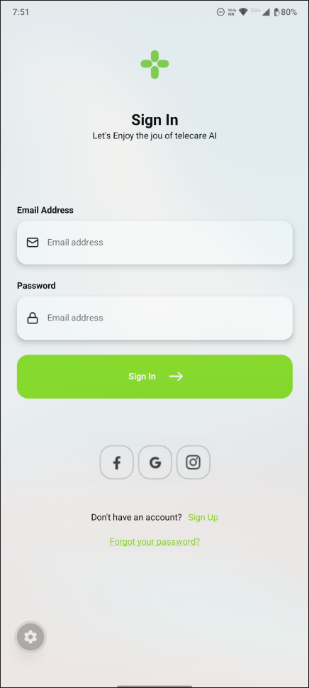

# Login Page

A modern mobile login application built with React Native and Expo.

## Screenshots



## Tech Stack

- **React Native** - Cross-platform mobile development
- **Expo** - Development framework and build service
- **Expo Router** - File-based navigation
- **TypeScript** - Type-safe development
- **React Navigation** - Native navigation

## Prerequisites

- Node.js 18+ and npm/yarn
- [Expo CLI](https://docs.expo.dev/get-started/installation/)
- Android Studio or Xcode (for native development)

## Installation

```bash
npm install
```

## Getting Started

Start the development server:

```bash
npm start
```

Choose your platform:

- **iOS**: Press `i` to open in iOS Simulator
- **Android**: Press `a` to open in Android Emulator
- **Web**: Press `w` to open in browser
- **Expo Go**: Scan QR code with [Expo Go app](https://expo.dev/go)

## Available Scripts

- `npm start` - Start development server
- `npm run ios` - Run on iOS
- `npm run android` - Run on Android
- `npm run web` - Run on web
- `npm run lint` - Lint code

## Project Structure

```
src/app/          # Application screens and routing
assets/           # Icons, images, and app assets
```

## Development

- Edit files in `src/app/` to modify screens
- Changes reload automatically with fast refresh
- Use TypeScript for type safety
